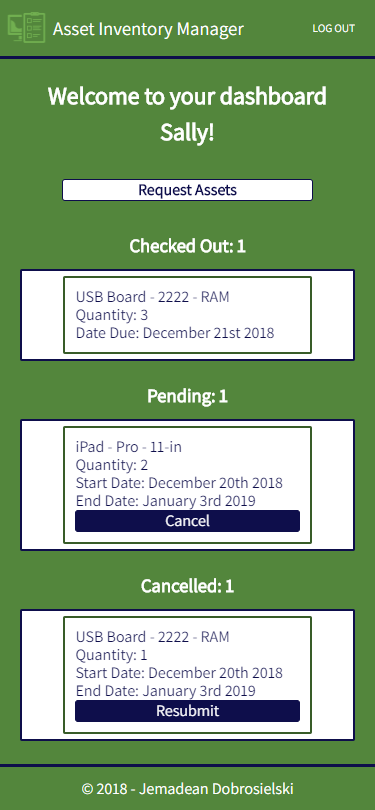
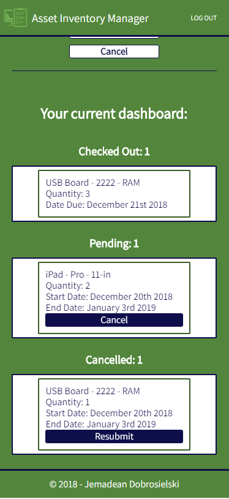

![Asset Manager Logo][logo]

[logo]: img/logo.png

# Asset Inventory Manager
An app to simplify and automate the inventory management of the hardware assets of your company, allowing requestors one quick and easy place to request assets, see the status of their requests, as well as see the assets for which they are currently responsible/own.  Requestors can also cancel pending requests they no longer need, and resubmit cancelled requests should they discover they will be needing the asset after all.

### **_[Live Demo](https://asset-manager-jem.herokuapp.com/ "Asset Inventory Manager")_**

#### Demo account:
##### username: sallysomeone
##### password: 666666

## V1 Feature List
 * Users are first taken to an introductory landing page where they will find instructions and links to create an account or login.
 * Users will be automatically logged in upon successful account creation, and once logged in they are taken to their dashboard.
 * Users can see all assets they have requested and the status of each asset.
 * Users can request assets from the dashboard, and see their dashboard while they are creating their request so they can reference what information from their requests as they create new requests.
 * Users can cancel pending requests if they no longer need the requested asset.
 * Users can resubmit requests they previously cancelled should they find they do need the asset after all.

## Screenshots
|  |  |  |
|:---:|:---:|:---:|
| Landing Page | Registration | Login |

|  |  |  |
|:---:|:---:|:---:|
| Dashboard | Request Assets | Request Assets with Dashboard |

## V2 Feature List
  * Request form: drop downs of available items would be nice and remove errors
  * Date picker currently allows dates in the past to be chosen, and end date can be before start date--need some restrictions here
  * Add ability to edit a pending request, for example to change the dates asset is needed
  * Add Dashboard for admin that fulfills these requests that allows them to see all pending requests, change status of requests, delete requests, update the database, and alert requesters when their assets are ready to be picked up.
  * Add auto alerts for requesters when asset is ready to be picked up.
  * Add ability to scan assets and badges upon check-out and check-in, which will also update the database, and send any auto-notifications.

## Tech Stack:
### Frontend

  * HTML5
  * CSS3
  * JavaScript
  * React
  * Redux
  * Deployed to Heroku

### Backend

  * Node/Express
  * MongoDB/Mongoose/mLab
  * JWTs for authentication
  * Deployed to Heroku

This is the backend for this app.  **_[The frontend can be found here.](https://github.com/JemDobro/asset-manager-client "Asset Inventory Manager")_**

## Key Components
 * All components live in the src directory. 
 * The app houses the navigation bar, header, the landing page, the create account page, the login page, and the footer.  
 * The landing page houses the dashboard.
 * The dashboard houses the request page, which is only visible if the user is requesting assets.
 * The navigation bar and header are always visible.
 * The footer is always visible at the very bottom.
